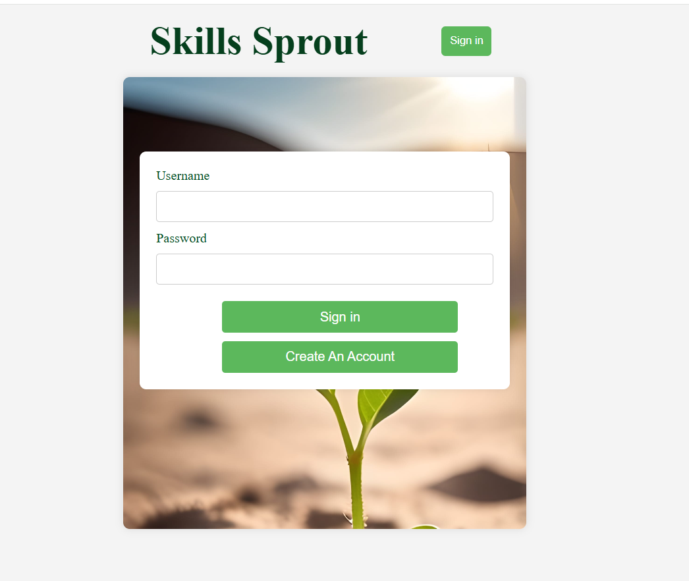
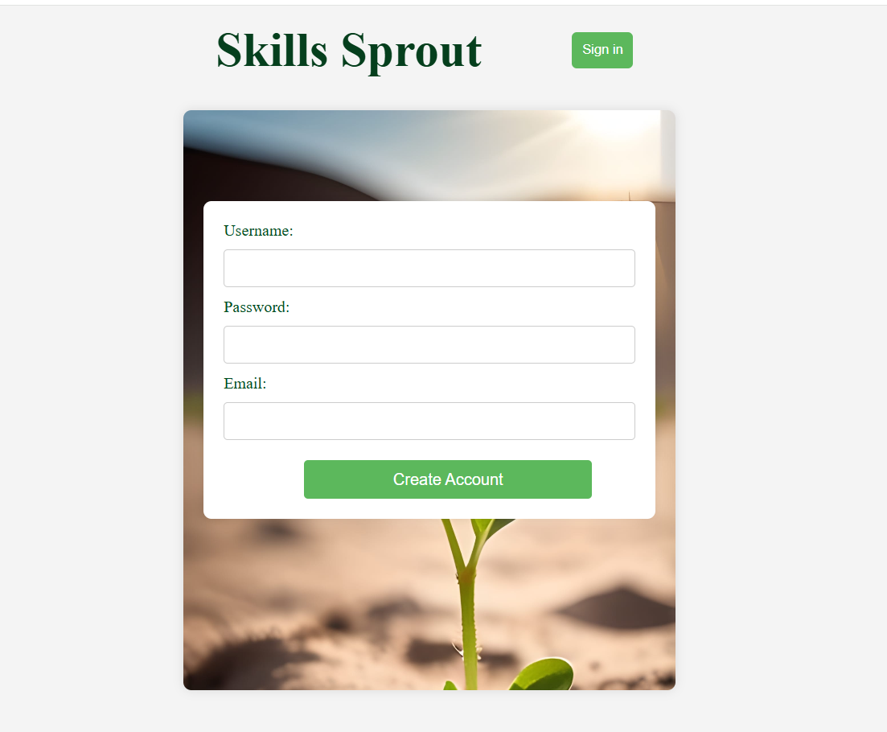
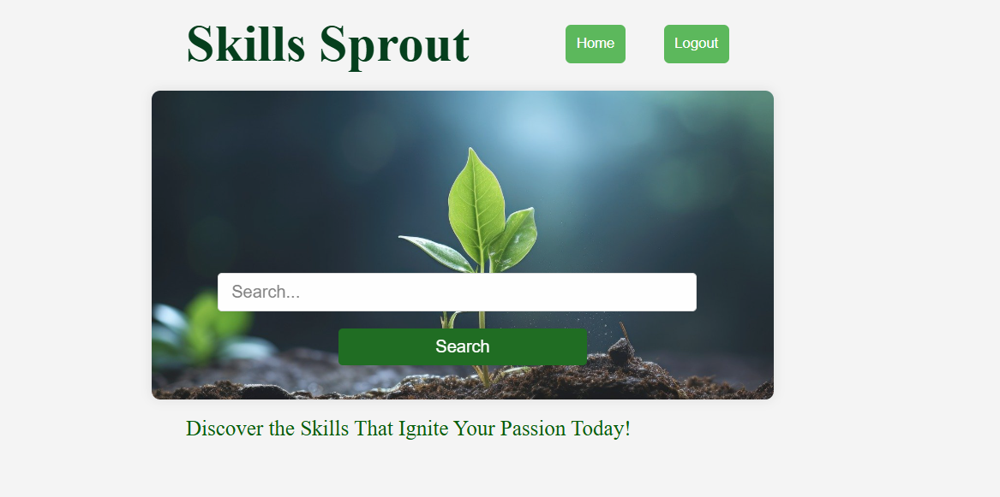
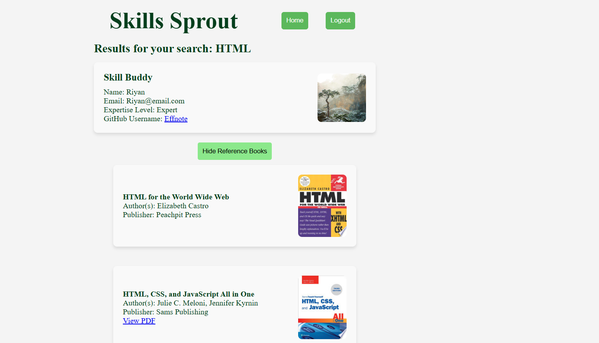

# SkillsSprout
Skills Sprouts is a web-based application that connects users with curated reference materials and relevant GitHub profiles based on their search queries. It leverages the power of Google Books API and GitHub API to provide a rich and interactive platform for discovering skills and associated resources.
**Features**
Search for Skills and Resources: Input a keyword to search for books and user profiles related to a specific skill.
Reference Books Integration: Utilizes the Google Books API to fetch books matching the search criteria, complete with detailed metadata.
Skill Buddy Matching: Identifies users with expertise in the searched skill and displays their contact information and skill level.
GitHub Profile Exploration: Fetches and displays relevant GitHub user information and repositories for skill buddies.
Responsive Design: Optimized for seamless use across desktop and mobile devices

**Frontend**: React, TypeScript, CSS
**Backend**: Node.js, Sequelize ORM (for database interaction)
**APIs Used:** Google Books API,GitHub API
**Authentication**: JSON Web Tokens (JWT)
**Database:** PostgreSQL

[](https://opensource.org/licenses/MIT)

## Table of Contents
- [SkillsSprout](#skillssprout)
  - [Table of Contents](#table-of-contents)
  - [How it works](#how-it-works)
  - [Usage](#usage)
  - [Installation](#installation)
  - [Screenshots](#screenshots)
  - [License](#license)
  - [Questions](#questions)


## How it works
When the app is loaded, the user is presented with the login page. User can login to the page with the username and passowrd. For new users , they can create an account. when the user login or creates an account the user is provided with the token, that will be authenticated for each request. JWT is used for authentication.
Once the user is having the token, theywill be presented with search page, where they can search for a skill. once is skill is entered the results will be displyed in the Results page. If there are no skill buddy for a given skill, then a error message saying no skill buddy availabe, please user the reference books. The reference books will be displayed once the suer clicks the show the reference books. They can goback to the search page from the results page by clicking the home button. A logout button is available to logout.

## Usage
Run npm run start:dev and navigate to the prompted URL to see your app in dev.
The app is deployed to render.Click the below link for working application.
https://skillsshareproject.onrender.com

## Installation
1. Clone the repository:
git@github.com:kristivent/SkillsShareProject.git

2.  Build
Install dependencies
```sh
npm i
```
3.  Connect to your Postgres server and run the following command
```postgres
\i server/db/schema.sql
```
Once you have created the database, fill in `.env` file with `DB_NAME`, `DB_USER`, `DB_PASSWORD` and other API Keys
GOOGLE_BOOKS_API_KEY=your-google-books-api-key
GIT_HUB_API_KEY=your-github-api-token
JWT_SECRET_KEY=your-jwt-secret
DB_URL=your-database-url

4.  Start the server and the client using
```
npm run start:dev
```

## Screenshots
The following image demonstrates the web application's appearance:









## License 
This project is licensed under the [MIT license](https://opensource.org/licenses/MIT).

## Questions
Reach out to our group via GitHub (all collaborators listed on repository).

